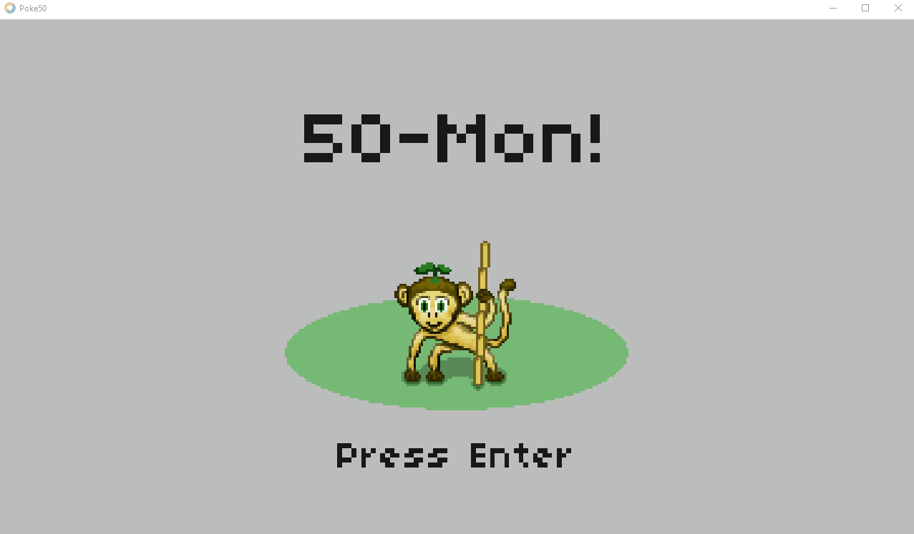

# 🐉 CS50 — Pokémon  

[](https://love2d.org/)
[](https://www.lua.org/)
[](https://cs50.harvard.edu/games/)
[](LICENSE)

**Course:** [CS50's Introduction to Game Development](https://cs50.harvard.edu/games/)  
**Assignment:** Pokémon  
**Engine / Language:** LÖVE2D (Lua)

---

## 📋 Project Overview

This repository contains my implementation of the **Pokémon** assignment from *CS50’s Introduction to Game Development*.  
🎮 The project recreates a simplified Pokémon battle system inspired by the original Game Boy titles — featuring turn-based combat, health mechanics, and level-up progression.  

In this version, I implemented an enhanced **Level-Up Stats Menu**, improving the feedback loop and making the experience more engaging and visually informative.

---

### 🧩 What I Implemented

- ✔️ **Level-Up Stat Menu**  
  Added a detailed **Level-Up Menu** that appears right after the "Level Up" dialogue following a victorious battle.

- ✔️ **Stat Breakdown Display**  
  The menu shows each stat’s progress in the format:
  ```
  X + Y = Z
  ```
  where:
  - `X` → Initial stat value  
  - `Y` → Increment gained on level-up  
  - `Z` → Resulting final value  

- ✔️ **Cursor Toggle Feature**  
  Enhanced the **Selection** class to accept a boolean argument that toggles the visibility of the menu cursor, ensuring a clean display without unnecessary navigation during the stat summary.

- ✔️ **Integration with State System**  
  Extended the **TakeTurnState** (particularly within the `:victory()` function) to:
  - Detect level-up events.
  - Push both the `BattleMessageState` and the new `Menu` to the **StateStack** in sequence.

- ✔️ **Level-Up Logic Handling**  
  Utilized the returned stat increments from `Pokemon:levelUp()` to populate the custom menu dynamically.

---

## 🎬 Gameplay Preview

  

---

## 🚀 How to Run

1. **Install LÖVE2D:**  
   Download and install from [LÖVE2D](https://love2d.org/).  


2. **Clone this repository:**  
   ```bash
   git clone https://github.com/huzaifa-gamedev/cs50-pokemon.git
   cd cs50-pokemon
   ```  

3. **Run the Game:**  
   ```bash
   love .
   ```  

---

## 🎯 Controls

- **Arrow Keys (↑ ↓ ← →)** — Navigate menus.  
- **Enter/Return** — Select an option or confirm.  
- **Escape** — Exit menu or quit game.  

---

## 🧠 Notes on Implementation

- **Menu Customization:**  
  Modified `Selection` and `Menu` classes to support cursor toggling and text-only displays.  

- **State Management:**  
  Integrated the new menu into the **StateStack** workflow, ensuring proper transitions between `BattleMessageState`, `Menu`, and post-battle states.

- **Level-Up Feedback:**  
  Designed the stats display to be clear, immediate, and consistent with Pokémon’s traditional visual style.

- **Testing:**  
  Verified functionality by simulating multiple battles, ensuring accurate stat calculation and menu sequencing.

---

## ✨ Credits

- Original skeleton code & assets: CS50's Introduction to Game Development (Harvard). Licensed under [CC BY-NC-SA 4.0](https://creativecommons.org/licenses/by-nc-sa/4.0/).  

---

## 📄 License

- This implementation: © 2025 Muhammad Huzaifa Karim. Licensed under the [MIT License](LICENSE).  

For more details, see [ATTRIBUTION.md](ATTRIBUTION.md).  

---

## ✍️ Author

**Muhammad Huzaifa Karim**  
[GitHub Profile](https://github.com/huzaifakarim1)

---

## 📬 Contact

For feedback, suggestions, or collaboration opportunities, feel free to reach out via [GitHub](https://github.com/huzaifakarim1).

---

© 2025 Muhammad Huzaifa Karim. All rights reserved.